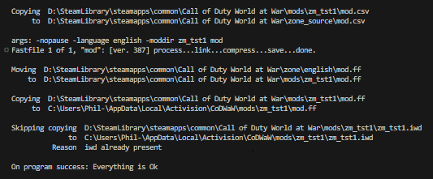
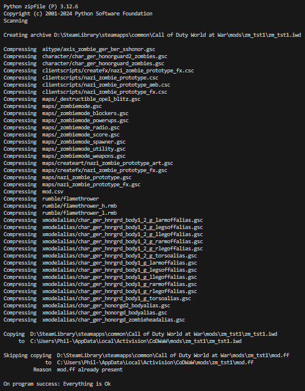
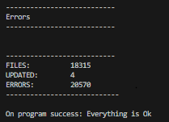
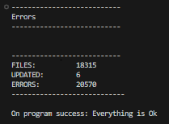

# cod_waw.mod_launcher.build_tools

3 modular components that do the same as the 3 stock waw mod launcher operations do on the 'Mod Builder' tab

## Features
- mod.ff
- .iwd
- custom sounds

## Installation

Download/clone the latest version and either run the module directly within vscode for example or drop the module into your own python project and connect it up.

## Usage

These are modular components that not only can be run right within vscode (or your editor of choice), but can also be used in other applications as well.

## Note

None

## Additional Notes

None

## Similar Projects

- https://github.com/Phils-Hub-Org/cod_waw.mod_launcher.compile_tools
- https://github.com/Phils-Hub-Org/cod_waw.mod_launcher.run_game_tools
- https://github.com/Phils-Hub-Org/cod_waw.mod_launcher.shortcut_tools

## License

MIT License

## Contributing
This project is open source and free to use, modify, and distribute under the terms of the [MIT License]

## Acknowledgements

This is a Phils-Hub community-contributed project.

## Screen Shots

- Build mod.ff output example

- Build .iwd output example

- Build sounds output example

## Showcase Video

https://www.youtube.com/watch?v=ZKVkgJzBWa8
